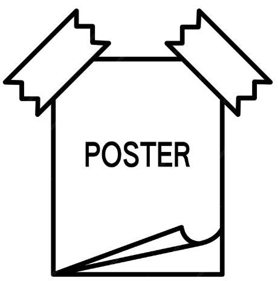

# Motion Segmentation for Neuromorphic Aerial Surveillance

This is the official repository for [Motion Segmentation for Neuromorphic Aerial Surveillance
](https://arxiv.org/abs/2405.15209) by [Sami Arja](https://samiarja.com/), Alexandre Marcireau, Saeed Afshar, Bharath Ramesh, Gregory Cohen


<table align="center">
  <tr>
    <td align="center" style="border:none;">
      <a href="https://samiarja.github.io/evairborne/" target="_blank">
        
      </a>
    </td>
    <td align="center" style="border:none;">
      <a href="https://arxiv.org/abs/2405.15209" target="_blank">
        
      </a>
    </td>
    <td align="center" style="border:none;">
      <a href="./figures/SamiArja_Poster_Neuromorphic_Aerial_Surveillance.pdf" target="_blank">
        
      </a>
    </td>
  </tr>
  <tr>
    <td align="center" style="border:none;">Project Page</td>
    <td align="center" style="border:none;">Paper</td>
    <td align="center" style="border:none;">Poster</td>
  </tr>
</table>

If you use this work in your research, please cite it:

```bibtex
@misc{arja_motionseg_2024,
	title = {Motion Segmentation for Neuromorphic Aerial Surveillance},
	url = {http://arxiv.org/abs/2405.15209},
	publisher = {arXiv},
	author = {Arja, Sami and Marcireau, Alexandre and Afshar, Saeed and Ramesh, Bharath and Cohen, Gregory},
	month = oct,
	year = {2024},
}
```


# Setup

## Requirements

- python: 3.8.x, 3.9.x, 3.10.x

## Tested environments

- Ubuntu 22.04
- Conda 23.1.0
- Python 3.8.18

# Installation

<!-- ```sh
git clone https://github.com/samiarja/ev_deep_motion_segmentation.git
cd ev_deep_motion_segmentation
python3 -m pip install -e .
conda env create -f environment.yml
conda activate your_env_name
``` -->


```sh
git clone https://github.com/samiarja/ev_deep_motion_segmentation.git
cd ev_deep_motion_segmentation
conda env create -f environment.yml
python3 -m pip install -e .
```

# Download dataset
You can download all the dataset from [google drive](https://drive.google.com/drive/folders/1iE8hitzrr1lO4TD4Af4u-JknKvFecfTc?usp=sharing)
The structure of the folder is as follows:

```
(root)/Dataset/
        EV-Airborne/
            (sequence_name1).es
            (sequence_name2).es
            (sequence_name3).es
            .....
        EV-IMO/

        EV-IMO2/

        DistSurf/

        HKUST-EMS/

        EED/

```


# Run

### Setup the config file
Please see the `./config/config.yaml` for an example on how to setup the initial parameters.

Modify the entries to specify the `dataset` and `seq` and other parameters.

The `seq` name can be extracted from the `.es` file. If the filename is:
`EED_what_is_background_events.es`

Then `seq` name is `what_is_background`. It is always between the dataset name (e.g. `EED`) and `events`. I will make this easier in future commits.

## Execute motion segmentation

```sh
python main.py
```

The output from every layer of the network is saved in subfolders in `./output` in this format:

```
input_frames
RAFT_FlowImages_gap1
RAFT_Flows_gap1
coarse
bs
tt_adapt
rgb
motion_comp
motion_comp_large_delta
config_EV-Airborne_recording_2023-04-26_15-30-21_cut2.yaml
EV-Airborne_recording_2023-04-26_15-30-21_cut2_events_with_motion_inter.h5
motion_segmentation_network_EV-Airborne_recording_2023-04-26_15-30-21_cut2.gif
```

Description of the content of each subfolder:

- **input_frames**: The original time surface frames.
- **RAFT_FlowImages_gap1**: Optical flow images generated by RAFT.
- **RAFT_Flows_gap1**: The optical flow data in `.flo` format.
- **coarse:** The initial output from `TokenCut` which use the optical flow and the event time surface.
- **bs:** The output of the bilateral solver which is a binary mask for each frame. If `crf: true`, then a `crf` folder will be created.
- **tt_adapt**: The output from dynamic mask refinement that smooth and correct the mask from the `bs` or `crf`.
- **rgb**: Overlay between the timesurface frame and the `tt_adapt`.
- **motion_comp** The output of the motion segmentation.
- **motion_comp_large_delta** The motion segmentation output but with a higher integration time `\delta t`.
- **config_EV-Airborne_recording_2023-04-26_15-30-21_cut2.yaml** The config file will be saved from `./config/config.yaml`.
- **EV-Airborne_recording_2023-04-26_15-30-21_cut2_events_with_motion_inter.h5**: The event with the continuous (i.e. motion) and discrete label (i.e. class id) it has the following structure: `'x','y','p','t','l','cl', 'vx', 'vy'`. `vx` and `vy` are the continuous motion labels and `cl` is the discrete label. Both are used to generate the motion segmentation output.
- **motion_segmentation_network_EV-Airborne_recording_2023-04-26_15-30-21_cut2.gif**: A video gif combining to show input and output of the motion segmentation. Plus there is gif file inside of each subfolder.

A faster implementation is also provided in `main_fast_single_object.py`, it only works if there for a single moving object.

```sh
python main_fast_single_object.py
```


## Acknowledgement
This code is built on top of [TokenCut](https://github.com/YangtaoWANG95/TokenCut_video), [DINO](https://github.com/facebookresearch/dino), [RAFT](https://github.com/princeton-vl/RAFT), and [event_warping](https://github.com/neuromorphicsystems/event_warping) (our previous work). We would like to sincerely thanks those authors for their great works. 
